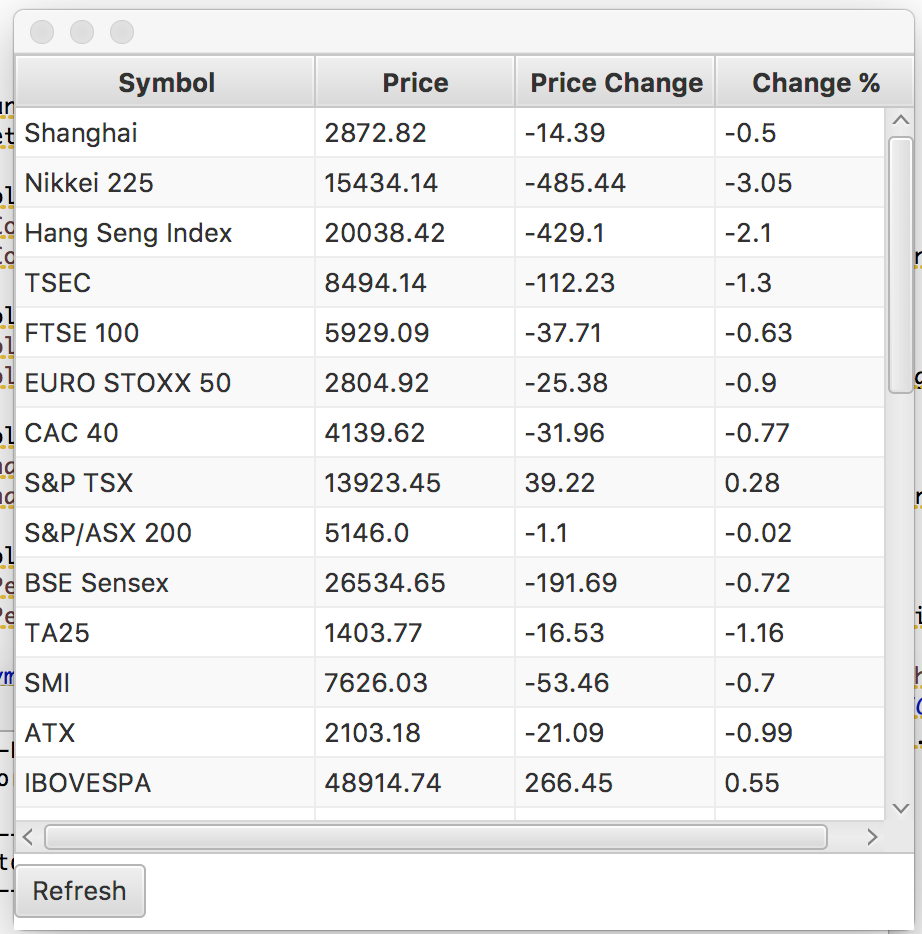
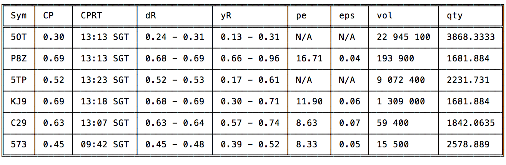

# mapDB
Example of mapDB , JSoup, CQEngine, JetBrains xodus,ibm streams and JavaFX.

It takes stock values from https://www.google.com/finance and stores into mapDB file database.

Put https://http://finance.yahoo.com/q values into CQCollection and runs query.

A stock based application using jsoup, mapdb and google finance. Storing stock values in mapDB.

Run worldMarket.sh and if everything is fine, you view the screen like below.

Added monitoring for Singapore stock exchange.
Edit src/main/resources/monitor_symbol.properties
monitor=5OT,P8Z,5TP,KJ9,C29,573

Edit the symbols you monitor. Then run ./sgxMonitor.sh

